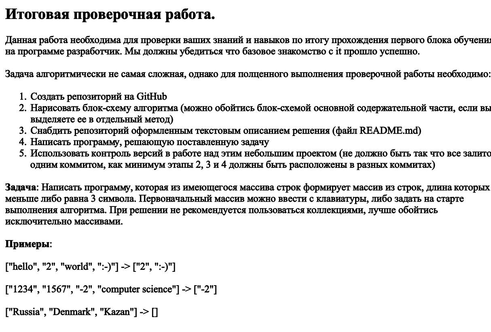
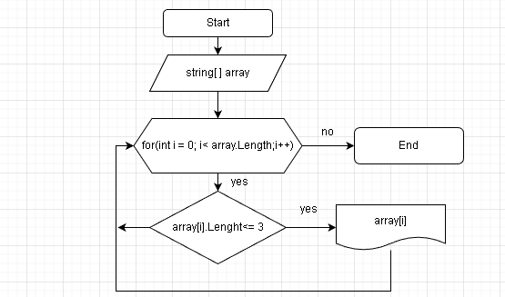

# Контрольная работа

* Задание № 1 Репозиторий создан.
* Задание № 2 
* Задание № 3 Файл [README](README.md) добавлен.
* Задание № 4 [Program](Program.cs)
* Задание № 5 [git log](https://github.com/IDDQDD/Test/commits/master)
##